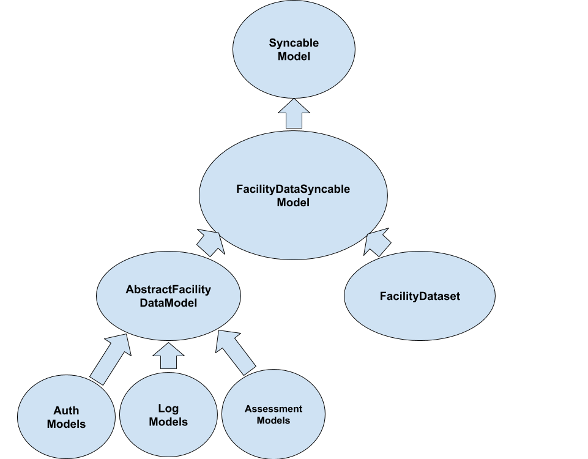
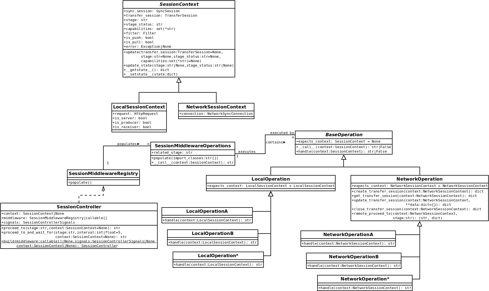
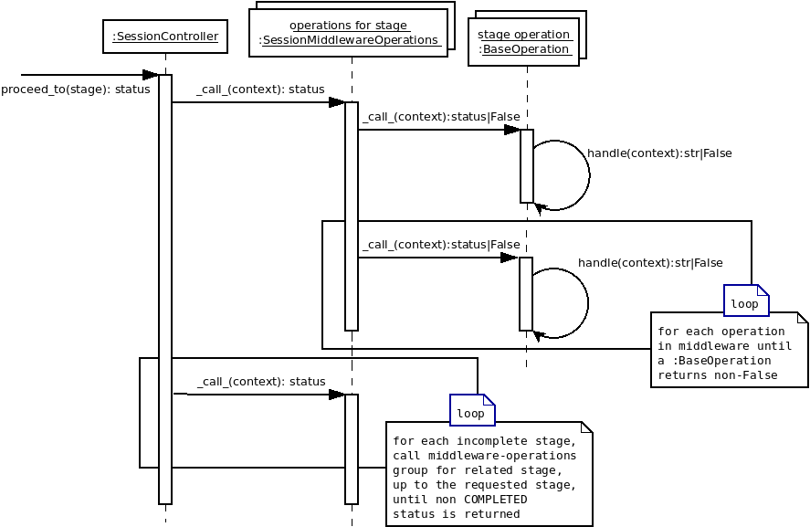

Architecture
============

Profiles
--------

A **profile** is a unique, semantically meaningful name within the Kolibri ecosystem. It corresponds to a set of interrelated `syncable models <#syncable-models>`__ that "make sense" when synced together.

Currently there is just a single profile in the Kolibri ecosystem: ``facilitydata``.

Syncable models
---------------

A **syncable model** is a Django model which can be synced between devices using Morango. Every syncable model is associated with exactly one `profile <#profiles>`__, and exactly one `partition <#partitions>`__ within the profile.

To make a Django model syncable, inherit from ``SyncableModel``. All subclasses need to define:

- ``morango_profile`` - the name of the model's profile
- ``morango_model_name`` - a unique name within the profile
- ``calculate_source_id`` - a method that returns a unique ID of the record
- ``calculate_partition`` - a method that returns the `partition string <#partitions>`__ of the record

There are some constraints to Django models that are serialized and synced in Morango:

- models must not have self-referential foreign keys or dependency loops
- models must not use relationships based on Django `generic foreign keys <https://docs.djangoproject.com/en/1.11/ref/contrib/contenttypes/#django.contrib.contenttypes.fields.GenericForeignKey>`_
- models must not use `many-to-many <https://docs.djangoproject.com/en/1.11/topics/db/examples/many_to_many/>`_ relationships

In order to ensure that schema migrations work cleanly, always provide default values when defining model fields on syncable models.

If you create custom querysets or managers and your model inherits from ``SyncableModel``, then your custom classes should also inherit from ``SyncableModelQuerySet`` or ``SyncableModelManager`` in order to maintain syncability for these models.

In Kolibri, we currently define a base ``SyncableModel`` called ``FacilityDataSyncableModel``. Both ``FacilityDataset`` and ``AbstractFacilityDataModel`` inherit from this. In turn, other syncable Kolibri models inherit from ``AbstractFacilityDataModel`` as shown below:

Partitions
----------

A **partition** is a string that defines a subset of the `syncable models <#syncable-models>`__ in a `profile <#profiles>`__. Taken together, the partitions of a profile define mutually exclusive and complete segmented coverage of all syncable model records.

Partition strings use colon characters to delimit levels of a hierarchy, and `Python template strings <https://docs.python.org/3/library/string.html#template-strings>`__ to dynamically insert source IDs of models. Aside from this, Morango places no constraints on the structure of partition strings, and they can be constructed using any convention or strategy. A leading part part of a colon-delimited partition string designating some parent partition is called a **partition prefix**.

As a hypothetical example, a record for a syncable model like a content interaction log might be associated with a syncable user in a syncable facility. The combination of the user ID and the facility ID could be used to dynamically define a partition like ``${facility_id}:${user_id}`` for that and other similar records. "Containment" of partitions in the hierarchy can be checked with a simple Python ``startswith`` string check between partitions. In the example above, the partition ``${facility_id}:${user_id}`` is said to be contained by the partition ``${facility_id}`` for user ``U1`` in facility ``F1`` because ``"F1:U1".startswith("F1") == True`` and ``F1`` is the partition prefix.

In Kolibri, we currently have five mutually-exclusive partitions in the ``facilitydata`` profile, where the source ID of the facility is the ``dataset_id``:

- everyone has write-only access
    - partition string: ``${dataset_id}:anonymous``
    - used for content session logs
- all authenticated users have read-only access
    - partition string: ``${dataset_id}:allusers-ro``
    - used for facility metadata, classes, and other collections
- a learner has personalized read-only access
    - partition string: ``${dataset_id}:user-ro:${user_id}``
    - used for user roles and membership in classes and groups
- a learner has personalized read and write access
    - partition string: ``${dataset_id}:user-rw:${user_id}``
    - used for content interaction logs
- everything else
    - partition string: ``${dataset_id}``
    - used for quizzes and lessons

Note that all facility models share the prefix ``${dataset_id}``, which means that they are all "contained" in that top-level partition.

Filters and scopes
------------------

A **filter** is a set of `partition prefixes <#partitions>`__ represented as an end-line-delimited string.  A **scope** is a set of filters which defines the permissions conferred by a `certificate <#certificates>`__ and stored in a ``ScopeDefinition`` object.

When designing scopes – i.e. composing scopes from filters and partitions – care must be taken to ensure that foreign keys in synced models refer to other models that were also synced in the same scope. Otherwise, an alternative would be to ensure that the application can gracefully handle missing records when necessary because there would be no guarantee of coherence.

As of this writing, there are currently two scope definitions defined in Kolibri for the ``facilitydata`` profile:

- The ``full-facility`` scope provides full read and write access to all data related to a facility. This includes the facility model itself plus associated classes, lessons, users, groups, content interaction logs, and everything else related to running a typical Kolibri classroom server.
- The ``single-user`` scope provides some of the access needed by a single learner, specifically the content interaction logs. Note that this does *not* currently include all necessary data. For example, lessons that have been assigned to the user are not in this scope, and must currently be synced through another mechanism (as yet to be determined).

Kolibri's `scope definition fixture <https://github.com/learningequality/kolibri/blob/bd3fe9a04e21e446da39fed92e83c75e11ef1714/kolibri/core/auth/fixtures/scopedefinitions.json>`__ is shown below. Here, note that the ``single-user`` scope allows the user to write content-related logs and to read other facility data so that Kolibri is still able to function properly.

.. code-block:: json

    [
      {
        "model": "morango.scopedefinition",
        "pk": "full-facility",
        "fields": {
          "profile": "facilitydata",
          "version": 1,
          "primary_scope_param_key": "dataset_id",
          "description": "Allows full syncing for data under the Facility with FacilityDataset ID ${dataset_id}.",
          "read_filter_template": "",
          "write_filter_template": "",
          "read_write_filter_template": "${dataset_id}"
        }
      },
      {
        "model": "morango.scopedefinition",
        "pk": "single-user",
        "fields": {
          "profile": "facilitydata",
          "version": 1,
          "primary_scope_param_key": "",
          "description": "Allows syncing data for FacilityUser ${user_id} under Facility with FacilityDataset ID ${dataset_id}.",
          "read_filter_template": "${dataset_id}:allusers-ro\n${dataset_id}:user-ro:${user_id}",
          "write_filter_template": "${dataset_id}:anonymous",
          "read_write_filter_template": "${dataset_id}:user-rw:${user_id}"
        }
      }
    ]

Certificates
------------

**Certificates** are hierarchical pairs of private/public keys that grant device-level permission to sync data within a `filtered scope <#filers-and-scopes>`__ of a `profile <#profiles>`__. Once a device has been granted access to a scope of a profile, that device can grant that scope or a subset of it to other devices by generating child certificate pairs.

Scope access and the chain of trust are established as follows:

- The private key associated with a parent certificate can be used to issue a child certificate to another device with at most the permission granted by the scope of the parent certificate
- The child certificate can be used by the new device to allow it to prove to other devices that it is authorized to access the scope
- The entire chain of signed certificates back to the origin must be exchanged during sync between devices, and the signatures and hierarchy must be verified

In the example below, *Instance A* is able to establish a future sync relationship with *Instance B* by providing admin credentials to *Instance B* and requesting a signed certificate:

.. image:: ./cert_exchange.png

It should be cautioned that there is currently no mechanism for revoking certificates. This means that a stolen or hijacked device will have access to all data it has been granted, and updates to that data when another device is on the same network.

In Kolibri, on the ``FacilityDataset`` model, we generate the certificate as a function of the ``calculate_source_id`` method. Note that we currently set the ID of the certificate to be the same as the ID of the facility model. This allows queries on the certificate hierarchy tree to find certificates that are associated with the facility.

There's flexibility in the application layer for determining the validity of a root certificate, and it's specified on a per-profile basis. For the ``facilitydata`` profile, Kolibri leverages its ``auth`` models for this.

.. _operations:

Session controller, contexts, and operations
--------------------------------------------

A unidirectional sync has several stages: ``INITIALIZING``, ``SERIALIZING``, ``QUEUING``, ``TRANSFERRING``, ``DEQUEUING``, ``DESERIALIZING``, and ``CLEANUP``. Each stage requires callable objects, referred to here simply as *operations*. Operations handle the necessary operational aspects of the transfer for each stage. The ``SessionController`` class establishes an internal API for invoking those operations through a Chain-of-responsibility software design pattern. Provided with a *context*, either a ``LocalSessionContext`` or a ``NetworkSessionContext``, the controller will iterate through each incomplete stage and invoke the operations for stage, passing along the context object. An operation isn't required to handle the context, which is analogous to a request object, but can defer responsibility to the next operation in the stage's list of operations by returning ``False``. At least one operation must handle the context, which is communicated by returning a ``transfer_statuses`` constant of either ``PENDING``, ``STARTED``, ``ERRORED``, or ``COMPLETED``.

The list of operations for each stage are configured through Django settings. The configuration key for each stage follows the pattern ``MORANGO_%STAGE%_OPERATIONS``, so the list/tuple of operations for the ``QUEUING`` stage access the ``MORANGO_QUEUING_OPERATIONS`` configuration value. Built-in operations implement a callable ``BaseOperation`` class by overriding a ``handle`` method. The ``BaseOperation`` class supports raising an ``AssertionError`` to defer responsibility to the next operation.

