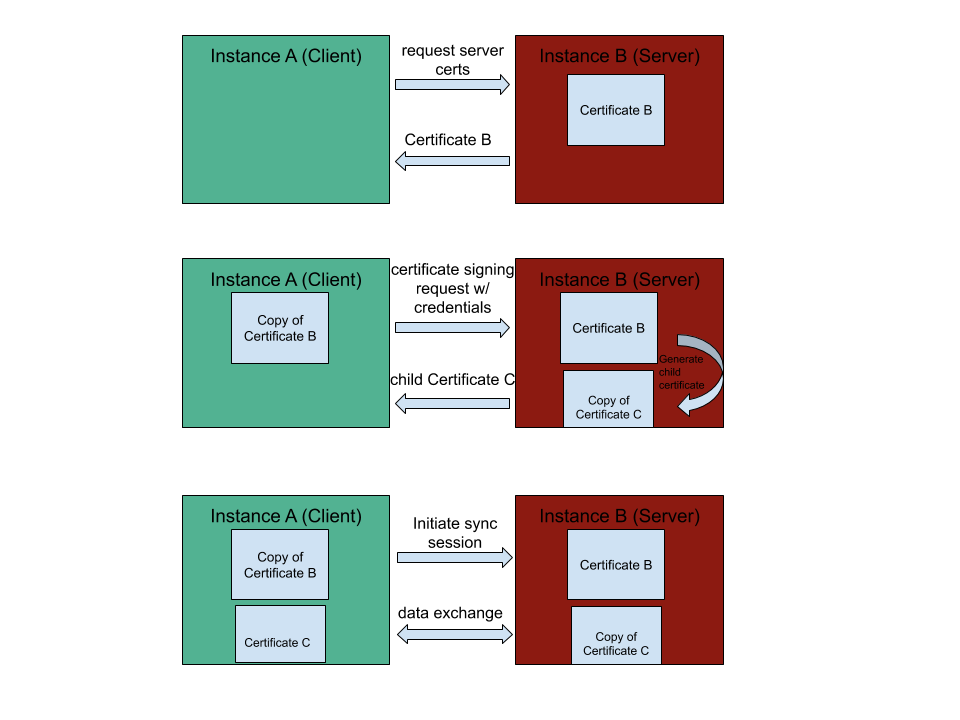

Certificates
============

One of the first actions that must occur before Morango instances can sync data is an exchange of certificates. This ensures that both sides have the proper permissions to sync the data.

Chain of trust
--------------

In order for certificates, to sign and generate other certificates which give a subset of permissions, we must have a chain of trust that can be followed all the way up to the root certificate:

- The private key associated with a certificate can be used to sign (issue) a new certificate with equivalent or a subset of the permissions
- This new certificate can then be used by another device to allow it to prove to other devices that it is authorized to access a particular set of data
- The entire certificate chain (the chain of signed certificates back to the origin) must be exchanged during sync, and the signatures as well as correctness (e.g. permissions always being a subset of the parent cert) must be checked all the way back up the chain to the Source of Authority
- The “Source of Authority” is the certificate that was created along with the top-level collection

Certificates in Kolibri
-----------------------

On the ``FacilityDataset`` model, we generate the certificate as a function of the ``calculate_source_id`` method.

Note that we currently set the ID of the certificate to be the same as the ID of the facility model. This allows queries on the certificate hierarchy tree to find certificates that are associated with the facility.

Certificate models
------------------

.. automodule:: morango.models.certificates
    :members:

Cryptographic key models
------------------------

.. automodule:: morango.models.fields.crypto
    :members:

