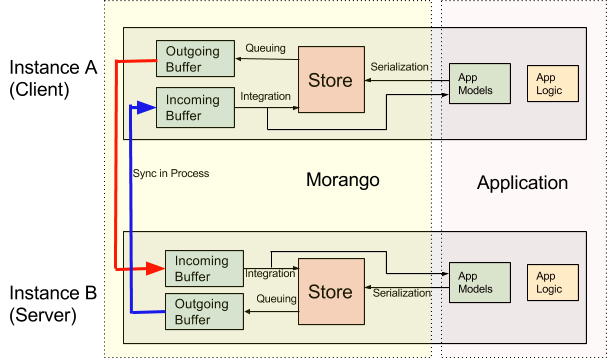
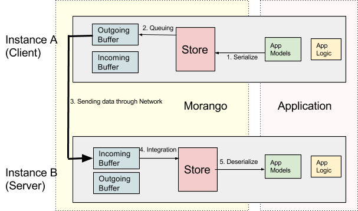

Concepts and Definitions
========================

Sync Process
------------

The Application layer is where app logic and app data (in the form of App Models) resides.
The Morango layer is where the store, outgoing buffer, and incoming buffer reside.
The application models are serialized in JSON format and saved to the Morango DB Store layer. Sync between
2 Morango instances proceeds through a handshake.  Morango instance A, which is  responsible for sending the data,
queues this data to the Outgoing Buffer from the Store layer. The transfer happens from the
sender's (Instance A) Outgoing Buffer to receiver’s (Instance B) Incoming Buffer. The data which
is received during a sync session is stored in an Incoming buffer for processing and is later integrated
in the Store as well as App Models.

Store
~~~~~
The store is a table in the default database that holds the serialized versions
of the models on the installed application. Whenever a sync happens, we
serialize the latest models and put them into the Store for transfer. The Store data structure is
where both the data that is on the current device and the data synced from other devices
lives.

Outgoing Buffer
~~~~~~~~~~~~~~~
The outgoing buffer mirrors the schema of the store, with an added "transfer
session" identifier. This transfer session identifier is used to identify groups
of data that are being synced together to other Morango instances.

Incoming Buffer
~~~~~~~~~~~~~~~
The incoming buffer also mirrors the schema of the store, with an added transfer
session identifier. This transfer session identifier is used to identify groups
of data that are being synced together to other Morango instances.

Operations
----------

1. Serialization: This is the process of serializing data that is associated with Django models
   in the Application layer, and storing it in JSON format in a record in the Store layer, along
   with additional metadata fields needed to facilitate syncing and integration.
2. Queueing: Queuing is similar to snapshotting where a chunk of serialized records that need
   to be sent during the sync process are stored in Outgoing Buffer. This prevents inconsistencies
   caused by a record being sent on network and its copy being changed by an in-process serialization.
3. Sending data through Network: The morango models will be serialized into JSON to send them over
   the network to another morango instance. We will be sending them by x number of records at a time, or another batch number specified
   by the user.
4. Integration: Process of merging the data received in an Incoming Buffer(by another morango instance)
   to Store layer as well as Application layer.
5. Deserialize: After integrating the received data into the store, we can then deserialize the data into models
   to be used in the application.
