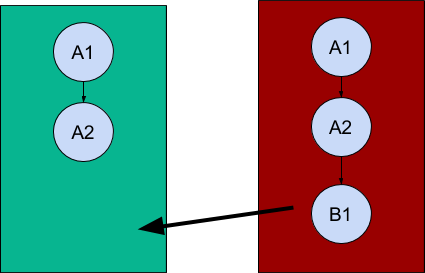

Fast-Forward
============

In this diagram, Device A(green) produces record with record ID r, r@A and
assigns it a record version of A1. Device A further makes changes to r@A and the
record version changes to A2, the history of r@A is [A2, A1] at this point.
Device B(red) now syncs data with Device A and both the devices have same
version of the record(r@A and r@B). Device B makes modifications to r@B which
changes record version to B1.The history of  r@B grows to [ B1, A2, A1]. When
device A syncs data with device B, the situation is known as a Fast-Forward. We
can determine this by checking if r@A’s current version is in r@B’s history or
vice-versa.
