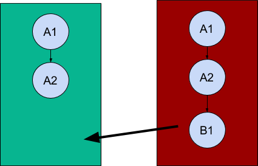

Merging
=======

There are two possible cases for the merging of data: fast-forward merges and conflicts.

Fast-forward merges
-------------------

A "fast-forward" data merge situation means that there is no conflict to resolve. This can be determined by checking if the current version of a record on the receiving device is already contained in the history of the transmitting device, or vice-versa.

In the illustration above:

1. *Device A* (green) produces a new record, ``r``. It gets assigned record version ``A1`` and history ``[ A1 ]``.
2. Next, *Device A* modifies ``r``. The record version changes to ``A2`` and the history is now ``[ A2, A1 ]``.
3. *Device B* (red) now syncs data with *Device A* and both the devices have same version and history of record ``r``.
4. *Device B* modifies its copy of ``r`` and sets the record version to ``B1``. The history of ``r`` is now ``[ B1, A2, A1 ]`` on *Device B* and still ``[ A2, A1 ]`` on *Device A*.
5. When *Device A* syncs with *Device B* again (the arrow), there is no conflict and the update ``B1`` can be incorporated directly.

Merge conflicts
---------------

A merge conflict means that two devices have made changes to a record, and it is not clear how to reconcile the two change histories.

.. image:: ./merge_conflict.png

In the illustration above:

1. As above, *Device A* (green) produces a new record ``r`` with version ``A1`` and history ``[ A1 ]``.
2. *Device B* (red) now syncs data with *Device A* and both the devices have same copy of record ``r``.
3. Next, *Device B* modifies its copy of ``r``. The record version changes to ``B1`` and the history ``[ B1,  A1 ]``.
4. *Device A* modifies its own copy of record ``r`` and saves it as ``A2`` with history ``[ A2, A1 ]``.
5. When *Device A* syncs data with *Device B* again (the arrow), there is a conflict because both devices have modified ``r``.

It is up to the implementing application to determine what the merge conflict resolution strategy is.

