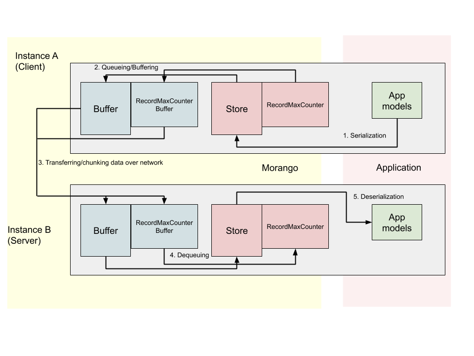

Syncing
=======

Sync process
------------

Syncing is the actual exchange of data in a sync session. The general steps for syncing data are:

1. **Serialization** - serializing data that is associated with Django models in the Application layer, and storing it in JSON format in a record in the Store
2. **Queuing/Buffering** - storing serialized records and their modification history to a separate Buffers data structure
3. **Transfer/chunking of data** - the actual transfer of data over a request/response cycle in chunks of 500 records at a time
4. **Dequeuing** - merging the data received in the receiving buffers to the receiving store and record-max counter
5. **Deserialization** - merging data from the receiving Store into the Django models in the Application layer

In the illustration below, the application layer (on the right) is where app data resides as Django models, and the Morango layer (on the left) is where the Morango stores, counters, and buffers reside. *Instance A* (on the top) is sending data to *Instance B* (on the bottom). Application Django models in *Instance A* are serialized in JSON format and saved to the store. Data is queued in the buffers on *Instance A*, and then transmitted to the corresponding buffers on *Instance B*. The data is then integrated into the store and Django app models on *Instance B*.

Orchestration
-------------

In order to facilitate synchronization between several Morango instances, it can be convenient to create a Django management command which uses the Morango machinery.

For example, in Kolibri we have created a management command called `kolibri manage sync <https://github.com/learningequality/kolibri/blob/91ddf6fe8e9404fd54278d91dc6d43b9540ea327/kolibri/core/auth/management/commands/sync.py>`_. Note that any time this command is run, we always both pull and push, which guarantees that both Kolibri databases will have the same data afterwards.

Of particular importance is the ``MorangoProfileController`` which can create a ``NetworkSyncConnection`` with another Morango instance.

Once the client establishes a network connection, both instances must exchange certificates so that they can prove that they have the proper permissions in order to push or pull the data. If the client side lacks the proper certificates, they should use the network connection to do a ``certificate_signing_request``, where they enter admin credentials of the other instance to generate a certificate with the valid permissions.

Once both sides have the proper certificates, the client can initiate a sync session with ``create_sync_session``. This creates a ``SyncClient`` that can handle either pushing or pulling data to/from the other Morango instance.

Signals
-------

During the sync process, Morango fires a few different signals from ``signals`` in ``PullClient`` and ``PushClient``. These can be used to track the progress of the sync.

There are four signal groups:

- ``session``
- ``queuing``
- ``transferring``
- ``dequeuing``

Each signal group has 3 stages that can be fired:

- ``started``
- ``in_progress``
- ``completed``

For a push or pull sync lifecycle, the order of the fired signals would be as follows:

1) Session started
2) Queuing started
3) Queueing completed
4) Transferring started
5) Transferring in progress
6) Transferring completed
7) Dequeuing started
8) Dequeuing completed
9) Session completed

